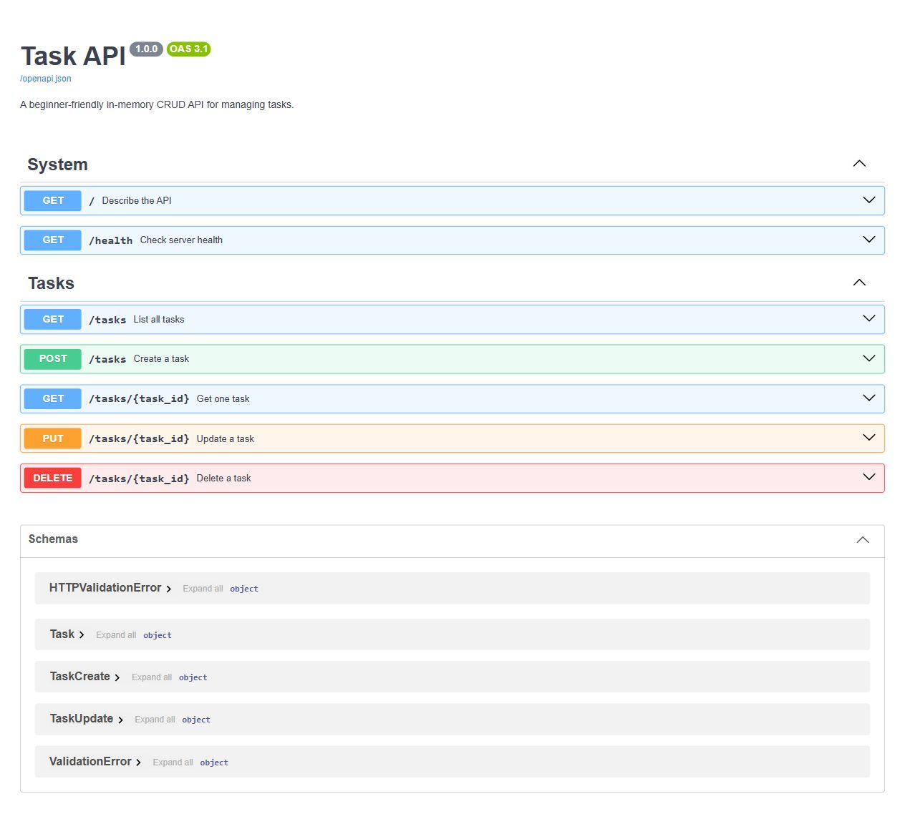

# Task API

This is my Week 2 backend assignment for the FlyRank AI Internship. I built a small in-memory to-do API with FastAPI. It supports the full CRUD cycle: create, read, update and delete tasks.

## What I learned

This project helped me understand how an HTTP method and a path work together as an endpoint. I also learned why an API should return clear status codes and validate a request before trusting it.

The task list is stored in memory. If the server restarts, any tasks added while it was running disappear and the three example tasks return. This is expected because the project does not use a database.

## Install and run

Python 3.10 or newer is required.

```bash
python -m venv .venv
```

Windows:

```bash
.venv\Scripts\activate
pip install -r requirements.txt
uvicorn app.main:app --reload
```

The API runs at `http://127.0.0.1:8000` and Swagger UI is available at `http://127.0.0.1:8000/docs`.

## Endpoints

| Method | Path | Purpose | Success status |
| --- | --- | --- | --- |
| GET | `/` | Show API information | 200 |
| GET | `/health` | Check that the server is running | 200 |
| GET | `/tasks` | List all tasks | 200 |
| GET | `/tasks/{task_id}` | Get one task | 200 |
| POST | `/tasks` | Create a task | 201 |
| PUT | `/tasks/{task_id}` | Update a task | 200 |
| DELETE | `/tasks/{task_id}` | Delete a task | 204 |

Invalid request bodies return `400` with a JSON error. An unknown task ID returns `404` with a JSON error.

## Example curl output

Command:

```bash
curl -i -X POST http://127.0.0.1:8000/tasks -H "Content-Type: application/json" -d '{"title":"Buy milk"}'
```

Output from the running API:

```text
HTTP/1.1 201 Created
server: uvicorn
content-type: application/json

{"id":4,"title":"Buy milk","done":false}
```

## Swagger UI

The screenshot below was taken from the running project. All required endpoints appear in the interactive documentation.



## Run the tests

```bash
pip install -r requirements-dev.txt
pytest -q
```

The automated test suite checks the CRUD cycle, validation, status codes, JSON errors and the empty `204` response.
